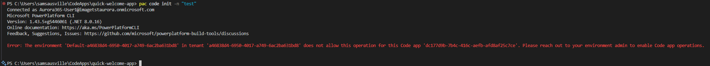

# Power Apps Code Apps (Early Access Preview) 🚀

> **Additional Documentation:**
>
> - [How to connect to Azure SQL](docs/how-to-connect-to-azure-sql.md) — Find a detailed walkthrough for connecting your code app to Azure SQL.

Power Apps empowers developers of all skillsets—including those building web apps in IDEs like Visual Studio Code—to efficiently build and run business apps on a managed platform.

**Code Apps** is a new way for developers to bring Power Apps capabilities into web apps built in a code-first IDE. These capabilities are available both during local development and when an app runs in Power Platform.

**Key features include:**

- Out-of-the-box Microsoft Entra authentication and authorization
- Access to 1,500+ Power Platform connectors, callable directly from JavaScript
- Easy publishing and hosting of line-of-business web apps in Power Platform
- Adherence to your organization’s Managed Platform policies (app sharing limits, Conditional Access, Data Loss Prevention, etc.)

The managed platform accelerates innovation in safe environments. When ready, apps can be deployed to dedicated production environments. Code Apps and the managed platform reinforce safe, rapid innovation, and, when ready, these apps can be deployed to dedicated production environments.

[**Sign up for Early Access**](https://aka.ms/paCodeAppsEAP)

# Table of Contents

- [What is a code app?](#what-is-a-code-app-)
- [Prerequisites](#prerequisites-)
  - [Install the following developer tools](#install-the-following-developer-tools)
  - [Create a first release Power Platform environment](#create-a-first-release-power-platform-environment)
- [Getting Started](#getting-started-)
- [Additional Scenarios](#additional-scenarios)
  - [Connect a code app to data](#1-connect-a-code-app-to-data-)
- [Supported managed platform capabilities](#supported-managed-platform-capabilities)
- [Limitations](#limitations)
- [Preview disclaimer](#preview-disclaimer)
- [License](#license-)
- [Code of Conduct](#code-of-conduct)

# What is a code app? ✨

Code apps allow developers to write custom code (React, Angular, Vue, etc.) that runs seamlessly within Power Platform. This gives you:

- **Full control over your UI and logic** 💻
- **Access to Power Platform data sources** 📊
- **Enterprise-grade authentication** 🔐
- **Simplified deployment and ALM** 🔄

# Prerequisites 📋

Code apps require several developer tools like Visual Studio Code, git, dotnet, node.js, and npm to be available on the command line.  

## Install the following developer tools

- [Visual Studio Code](https://code.visualstudio.com/)
- [Node.js](https://nodejs.org/) (LTS version)
- [Git](https://git-scm.com/)
- [Power Apps CLI](https://learn.microsoft.com/en-us/power-platform/developer/cli/introduction)

## Create a first release Power Platform environment

First release environments are intended for non-production use and they receive Power Platform updates before other environments. For code apps EAP, it's recommended that you use a first release environment (it is required for SQL connector). Code app capabilities will eventually be available to all environments. Code apps require dataverse to exist in the environment.  

> [!IMPORTANT] Early access preview participants must inform Microsoft of the first release environment you want code apps enabled.

### Option 1 - Create a first release environment using PAC CLI

```PowerShell
pac admin create --name 'Code Apps' --region 'unitedstatesfirstrelease' --type 'Developer'
```

### Option 2 - Create a first release environment using command line

Be sure to set LocationName to “unitedstatesfirstrelease”. [Learn more](https://learn.microsoft.com/power-platform/admin/powerapps-powershell)

```PowerShell
New-AdminPowerAppEnvironment -DisplayName "Code App env" -EnvironmentSku Trial -LocationName "unitedstatesfirstrelease" -ProvisionDatabase 
```

## License end-users with Power Apps Premium

End-users that run code apps will need a [Power Apps Premium license](https://www.microsoft.com/power-platform/products/power-apps/pricing).

# Getting Started 🚀

## 1. Clone this repository

This repository has the start of a TypeScript app that already includes the Power Platform SDK. Later in EAP we'll add guidance to that allows you to start from scratch without using this base app.

```bash
git clone https://github.com/microsoft/PowerAppsCodeApps.git
cd PowerAppsCodeApps\samples\HelloWorld
```

## 2. Authenticate PAC CLI and point to your first release environment

```bash
pac auth create --environment {environment id}
```

## 3. Install dependencies

```bash
npm install
pac code init --displayName "Hello World"
```

>[!NOTE] If you observe a PAC CLI error stating the environment does not support code apps it means Microsoft didn't enable code apps for your environment. Use the documentation provided in your EAP welcome email to submit the environment to Microsoft.
> 

## 4. Run locally

```bash
npm run dev 
```

## 5. Deploy to Power Apps

```bash
npm run build | pac code push
```

If successful, this command should return a Power Apps URL to run the app.

Optionally, you can navigate to <https://make.powerapps.com> to see the app in the Maker Portal. You can play, share, or see details from there.

Congratulations! You have successfully pushed your first code app!

> [!NOTE] If you get stuck on the “fetching your app” loading screen or see an “App timed out” error screen, double check:
>
> 1. that you ran npm run build
> 2. there are no issues in PowerProvider.tsx

# Additional Scenarios

## 1. Connect a code app to data 🔌

Code apps enable connecting to Power Platform connectors. To do this, you will create connections, add them to the app, and update the app to call them.

Note that these steps require that you have completed the Getting Started section and already initialized the app with “pac code init”.

> [!IMPORTANT] For the initial release, only SQL, SharePoint, and Office 365 Users connectors are formally supported. Other connectors (e.g. SharePoint) are expected to work but are untested. Dataverse is explicitly not supported, yet.

### Create and set up connections in Maker Portal

You will need to start by creating and configuring connections at <https://make.powerapps.com> and you’ll need to copy connection metadata from there for use in later steps.

> [!IMPORTANT] For the initial release, you can only configure code apps to use existing connections that have already been pre-created in the make.powerapps.com. You cannot create new connections through PAC CLI commands. Support for creating new connections will be added in a future release.

#### 1. Launch the Maker Portal Connections page

Go to <https://make.powerapps.com> and navigate to the Connections page from the left-hand navigation.


#### 2. Create an Office 365 Users connection

Click “+ New connection” and select Office 365 Users. Click “Create”.

> [!NOTE] If you already have an Office 365 Users connection, you can use that instead of creating a new one.


#### 3. (Optional) Create a SQL connection (or a connection for another tabular data source)

> **Tip:** For a step-by-step guide to connecting your code app to Azure SQL, see [docs/how-to-connect-to-azure-sql.md](docs/how-to-connect-to-azure-sql.md).

#### 4. Get connection metadata for all created connections

You can use the Power Apps CLI to list your available connections and retrieve their IDs:

```bash
pac connection list
```

This command will display a table of all your connections, including the **Connection ID** and **API Name** (which is used as the appId when adding a data source).


You can also retrive this using the maker portal:


Copy the API name and the connection ID from PAC CLI the URL for each connection:

### Create and set up connections

Once you have created or identified existing connections to use and copied the connection metadata from the previous step, you will now add those connections to the app.

Adding the data sources to the app will automatically generate a strongly typed Typescript model and service file in the repo. For example, the Office 365 Users data source will produce Office365UsersModel and Office365UsersService.

#### 1. Add a non-tabular data source (e.g. Office 365 Users) to the app

From a command line, run the following. Use the API name and connection ID collected from Step #2 above.

```bash
pac code add-data-source -a <apiName> -c <connectionId>  
```

Example

```bash
pac code add-data-source -a "shared_office365users" -c "aa35d97110f747a49205461cbfcf8558"
```

>[!NOTE] If you observe a PAC CLI 403 error whent attempting to add a data source, which you have access to, it's expected to be a result of not using a first release environment as guided above.
> 

#### 2. (Optional) Add a tabular data source (e.g. SQL, SharePoint) to the app

From a command line, run the following. Use the API name and connection ID collected from Step #2 above.

>[!NOTE] You will additionally need to pass a table ID and dataset name, which is controlled by the schema of your tabular data source. If you don’t already have these, instructions on how to find it are below.

```bash
pac code add-data-source -a <apiName> -c <connectionId> -t <tableId> -d <datasetName> 
```

Examples

```bash
pac code add-data-source -a "shared_sql" -c "c9a56bae5dcb43f7ac086a2fc86fd33c" -t "[dbo].[MobileDeviceInventory]" -d "paconnectivitysql0425.database.windows.net,paruntimedb"

pac code add-data-source -a "shared_sql" -c "c9a56bae5dcb43f7ac086a2fc86fd33c" -t "[dbo].[EmployeeInformation]" -d "paconnectivitysql0425.database.windows.net,paruntimedb" 
```

>[!IMPORTANT] The following steps to retrieve a dataset name and table id are a temporary workaround. We plan to add an easier mechanism to get these values.

If you don’t already have the table and dataset name, you will have to get them by running a canvas app and copying the values from the browser network inspector:

1. Create a new canvas app in Studio.
2. Add the connection to a canvas app.
3. Bind the connection to a gallery control.
4. Publish and run the app.
5. Open your browser’s Developer Tools, go to the Network tab, and inspect requests made when the app loads. Check the “invoke” request, and go to its response.
6. Find an APIM request with the connection ID, dataset name, and table ID, and copy those values.

Example data request URL through APIM. The bolded sections are the **connection ID**, **dataset name** and **table ID**.

https[]()://0aa4969d-c8e7-e0a7-9bf8-6925c5922de3.01.common.tip1002.azure-apihub.net/apim/sharepointonline/**ad4035b2c5d6496d9ad095d2b134a5e6**/datasets/**https%253A%252F%252Fauroratstgeo.sharepoint.com%252Fsites%252FTEST_Aurora_TST**/tables/**d1709e17-387c-4f02-89b9-19a0421a841a**/items

| property      | example value                                                                 |
|---------------|-------------------------------------------------------------------------------|
| connection ID | ad4035b2c5d6496d9ad095d2b134a5e6                                              |
| dataset name  | https%253A%252F%252Fauroratstgeo.sharepoint.com%252Fsites%252FTEST_Aurora_TST |
| table ID      | d1709e17-387c-4f02-89b9-19a0421a841a    |

#### 3. (Optional) Add a SQL stored procedure as a data source

From a command line, run the following. Use the API name and connection ID collected from Step #2 above.

```bash
pac code add-data-source -a <apiId> -c <connectionId> -d <dataSourceName> -sp <storedProcedureName> 
```

Example

```bash
pac code add-data-source –a "shared_sql" -c "c9a56bae5dcb43f7ac086a2fc86fd33c" -d "paconnectivitysql0425.database.windows.net,paruntimedb" -sp "[dbo].[GetRecordById]" 
```

#### 4. (Optional) If needed, you can delete data sources after adding

From a command line, run the following. Use the API name and connection ID collected from Step #2 above.

```bash
pac code delete-data-source -a <apiName> -ds <dataSourceName> 
```

Example

```bash
pac code delete-data-source -a "shared_sql" -ds "MobileDeviceInventory" 
```

>[!IMPORTANT] If the schema on a connection changes, there is no command to refresh the strongly typed model and service files. To do this, delete the data source and re-add it.

### Update the app to call connections

Once connections are added, you can update the app to use the generated model and service.

>[!NOTE] These changes can also be made via with an IDE’s agent. For instance, in Visual Studio Code you may use Github Copilot agent mode to make them for you after the data sources have been added.

#### 1. Update the app to use the non-tabular data source (e.g. Office 365 Users)

You can see the generated files under the src/Models and src/Services folders for the strongly typed connection API.

```code
await Office365UsersService.MyProfile() 
```

```code
 const profile = (await Office365UsersService.MyProfile_V2("id,displayName,jobTitle,id,userPrincipalName")).data; 
    setUser(profile); 
    if (profile?.id || profile?.userPrincipalName) { 
      // Try both id and userPrincipalName for photo 
      let photoData = null; 
      try { 
        photoData = (await Office365UsersService.UserPhoto_V2(profile.id || profile.userPrincipalName)).data; 
      } catch { 
        // fallback to userPrincipalName if id fails 
        if (profile.userPrincipalName) { 
          photoData = (await Office365UsersService.UserPhoto_V2(profile.userPrincipalName)).data; 
        } 
      } 
      if (photoData) setPhoto(`data:image/jpeg;base64,${photoData}`); 
```

#### 2. (Optional) Update the app to use the tabular data source (e.g. SQL)

You can see the generated files under the src/Models and src/Services folders for the strongly typed connection API.

Example

```code
await MobileDeviceInventoryService.create(<record>) 
await MobileDeviceInventoryService.update(id, <record>) 
await MobileDeviceInventoryService.delete(id) 
await MobileDeviceInventoryService.get(id) 
await MobileDeviceInventoryService.getall() 
```

```code
await MobileDeviceInventoryService.update(assetId, changedFields); 
setAssets((prevAssets) => 
  prevAssets.map((asset) => { 
    if (asset.id === assetId) { 
```

#### 3. Run the app locally to verify changes

```bash
npm run dev
```

#### 4. Push the app to run on Power Apps

```bash
npm run build
pac code push
```

## 2. Hide the Power Apps header when playing an app
You can hide the header that appears when playing an app adding 'hideNavBar=true' as a query string parameter. In practice, append this to the app link before sharing the app link. 

<pre>
https://apps.powerapps.com/play/e/{environment id}/a/{app id}

https://apps.powerapps.com/play/e/{environment id}/a/{app id}?<b>hideNavBar=true</b>
</pre>

# Supported managed platform capabilities  

|                                                         Capability                                    |                                                Notes                                 |
|-----------------------------------------------------------------------------------------|----------------------------------------------------------------------------|
| End-users see consent dialog for connector permissions | [Learn more](https://learn.microsoft.com/power-apps/maker/canvas-apps/add-manage-connections#consent-dialog-fine-grained-permssions)|
| Sharing limits | Code apps respect canvas app sharing limits. [Learn more](https://learn.microsoft.com/power-platform/admin/managed-environment-sharing-limits)  |
| App Quarantine | [Learn more](https://learn.microsoft.com/power-platform/admin/admin-manage-apps?tabs=new#manage-app-quarantine-state) |
| Data Loss policy enforcement during app launch | [Learn more](https://learn.microsoft.com/power-platform/admin/wp-data-loss-prevention) |
| Conditional Access on an individual app | [Learn more](https://learn.microsoft.com/power-platform/admin/admin-manage-apps?tabs=new#managed-environments-conditional-access-on-individual-apps) |
| Admin consent dialog suppression | Consent suppression is supported for both Microsoft connecters that use OAuth as well as custom connectors that use OAuth. [Learn more](https://learn.microsoft.com/power-apps/maker/canvas-apps/add-manage-connections#suppress-consent-dialog-for-apps-that-use-custom-connectors-using-microsoft-entra-id-oauth)  |
| Tenant isolation | [Learn more](https://learn.microsoft.com/power-platform/admin/cross-tenant-restrictions) |

# Limitations

1. Code apps can invoke APIs outside of Power Platform connectors. Code apps do not support [Content Security Policy](https://learn.microsoft.com/power-platform/admin/content-security-policy) (CSP), yet. 
2. Code apps don’t support Power Platform Native source code integration.
3. Code apps don’t support Dataverse solutions and therefore cannot use Power Platform pipelines for deployments.
4. Code apps don’t have a Power Platform native integration with Azure Application Insights. Azure Application Insights can be added as it would be to a generic web app but it will not include information recognized in the platform layer, such as app open events (to measure success/failure)

# See also
1. [Limits and config](./docs/limits-config.md)

# Preview disclaimer

Preview features are features that aren’t complete but are made available on a “preview” basis so customers can get early access and provide feedback. Preview features are not supported by Microsoft Support, may have limited or restricted functionality, aren’t meant for production use, and may be available only in selected geographic areas.  

# License 📄

This project is licensed under the MIT License - see the [LICENSE](LICENSE) file for details.

# Code of Conduct

This project has adopted the [Microsoft Open Source Code of Conduct](https://opensource.microsoft.com/codeofconduct/).
For more information see the [Code of Conduct FAQ](https://opensource.microsoft.com/codeofconduct/faq/) or
contact [opencode@microsoft.com](mailto:opencode@microsoft.com) with any additional questions or comments.
